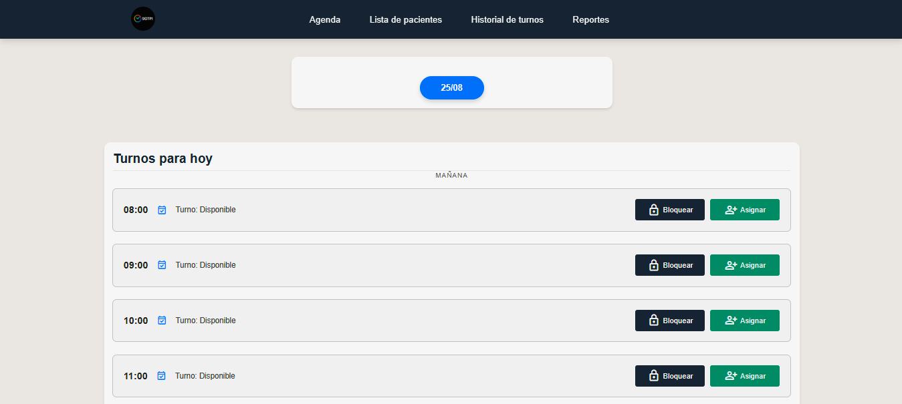

<h1 align="center">Hola 👋  soy Joaquin Ribarola </h1> 

  

 
<h2>Sobre mi 😃</h2>
<!--Intro start-->

🎓 Estudiante de Licenciatura en Sistemas.

💻 Me apasiona el mundo del desarrollo de software, en busca de aprender cada dia un poco más.

📝 roles : desarrollador Backend con Java SpringBoot, Frontend con Angular y BD con SQL.

📫 Contacto: **joaquinribarola45@gmail.com**
<!--Intro end-->
  

 

<h2 >Tecnologías conocidas👨🏻‍💻</h2>
<!--tech stack icons-->

  
  
  
  
  
  
  
  
  
  
  
  
  
  
  
  
  
  
  
  

 

<!-------------------------->

 <h2 align="center">proyectos</h2>

<table align="center">
  <tr>

  <!-- Proyecto 1 -->
<td align="center" style="padding: 10px; vertical-align: top;">
      

        
         
        
      

    </td>

<!-- Proyecto 2 -->
   <td align="center" style="padding: 10px; vertical-align: top;">
      

        
         
        
      

    </td>

  </tr>
</table>

